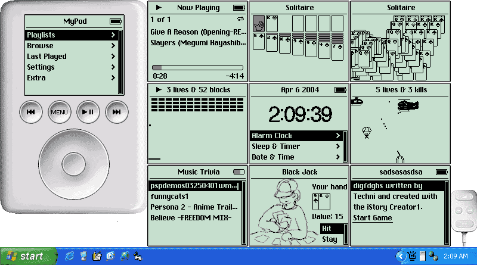



## iPod v2

### Description

A functional and nearly complete iPod clone. Contains the iPod's media databasing features, nearly complete replica of the menu system, 3 of the 4 gen3 games. A remote for a minituraized GUI. An exact replcia of the button/thumbwheel interface. And near exact replica of the LCD font. Switched to a smaller screenshot/mosaic, added double buffering, battery icon will show your actual battery status if you're using a laptop. Fixed some solitaire bugs, implemented the ability to change options. Started a game profile. Has blackjack, hopefully no more ghost menus. Parashoots can now be shot out without killing the paratrooper. Can read iPod notes. Added music trivia game
 
### More Info
 
Normally, I really hate when codes (coughEVANcough) post the same code repeatedly only slightly changing the name. However, this version has major updates to the UI, fixing multiple bugs. Adding many features, and a completed version of solitaire. I also am still in need of someone owning an iPod to get the rest of the missing elements off of

             |
---                |---
**Submitted On**   |2004-05-03 13:39:58
**By**             |[Techni Rei Myoko](https://github.com/Planet-Source-Code/PSCIndex/blob/master/ByAuthor/techni-rei-myoko.md)
**Level**          |Advanced
**User Rating**    |3.9 (27 globes from 7 users)
**Compatibility**  |VB 6\.0
**Category**       |[Sound/MP3](https://github.com/Planet-Source-Code/PSCIndex/blob/master/ByCategory/sound-mp3__1-45.md)
**World**          |[Visual Basic](https://github.com/Planet-Source-Code/PSCIndex/blob/master/ByWorld/visual-basic.md)
**Archive File**   |[iPod\_v2174053532004\.zip](https://github.com/Planet-Source-Code/techni-rei-myoko-ipod-v2__1-52731/archive/master.zip)

